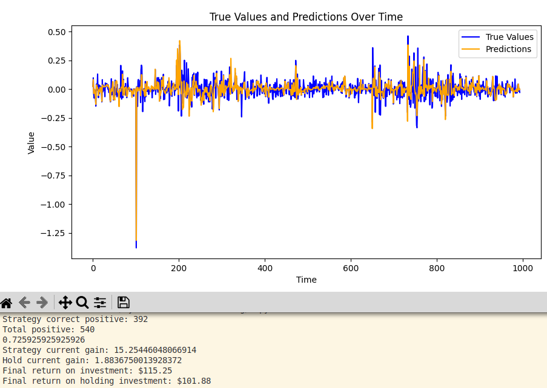

# Simple Stock Transformer

A PyTorch implementation of a Transformer-based model for stock price prediction using technical indicators and time-series forecasting.



## Overview

This project demonstrates a complete machine learning pipeline for financial time-series forecasting using a Transformer architecture. The model predicts future stock movements by analyzing historical price data and technical indicators, making it suitable for algorithmic trading strategies and financial analysis.

### Key Features

- **Transformer Architecture**: Custom implementation with causal masking for time-series prediction
- **Technical Indicators**: Comprehensive feature engineering with 15+ technical indicators
- **Data Pipeline**: Automated data fetching, preprocessing, and feature generation
- **Evaluation**: Multiple metrics including backtesting strategies
- **GPU Acceleration**: CUDA support for faster training
- **Monitoring**: Weights & Biases integration for experiment tracking

## Installation

### Dependencies

Install all required packages using pip:

```bash
pip install -r requirements.txt
```

Or install individually:
```bash
pip install torch torchvision torchaudio
pip install numpy pandas matplotlib scikit-learn
pip install yfinance wandb tqdm
```

## Project Structure

```
Simple-Stock-Transformer/
├── src/
│   ├── model.py           # Transformer model implementation
│   ├── features.py        # Technical indicators and feature engineering
│   ├── get_source_data.py # Data fetching from Yahoo Finance
│   ├── preprocess.py      # Data preprocessing and sequence creation
│   ├── input_pipe.py      # PyTorch Dataset and DataLoader
│   ├── train.py           # Training loop and model optimization
│   ├── evaluate.py        # Model evaluation and backtesting
│   └── predict.py         # Inference and prediction pipeline
├── models/
│   └── best_model.pth     # Trained model weights
├── feature_dataframes/
│   ├── AAPL_features.pkl  # Preprocessed Apple stock features
│   └── SPY_features.pkl   # Preprocessed S&P 500 ETF features
├── images/
│   └── Example.png        # Example model predictions
└── ReadMe.md
```

## Quick Start

1. **Clone the repository**
   ```bash
   git clone https://github.com/yourusername/Simple-Stock-Transformer.git
   cd Simple-Stock-Transformer
   ```

2. **Install dependencies**
   ```bash
   pip install -r requirements.txt
   ```

3. **Train the model**
   ```bash
   python src/train.py
   ```

4. **Make predictions**
   ```bash
   python src/predict.py
   ```

## Usage

### Training a Model

```python
# Train on AAPL data
python src/train.py
```

### Making Predictions

```python
# Generate predictions on test data
python src/predict.py
```

### Custom Data

To train on different stocks, modify the symbol in the respective scripts:

```python
# In train.py or predict.py
symbol = "TSLA"  # Change to desired stock symbol
```

## Technical Indicators

The model uses a comprehensive set of technical indicators:

**Trend Indicators:**
- Simple & Exponential Moving Averages (SMA, EMA)
- Moving Average Convergence Divergence (MACD)
- Average Directional Index (ADX)

**Momentum Indicators:**
- Relative Strength Index (RSI)
- Rate of Change (ROC)
- Stochastic Oscillator
- Williams %R

**Volatility Indicators:**
- Bollinger Bands
- Average True Range (ATR)
- Commodity Channel Index (CCI)

**Volume Indicators:**
- On-Balance Volume (OBV)
- Volume Rate of Change

## Model Architecture

The Transformer model features:

- **Encoder Layers**: Multi-head self-attention with causal masking
- **Positional Encoding**: Sinusoidal position embeddings
- **Feed-Forward Networks**: Two-layer MLPs with ReLU activation
- **Residual Connections**: Skip connections with layer normalization
- **Dropout**: Regularization to prevent overfitting

### Hyperparameters

- **Sequence Length**: 60 time steps
- **Embedding Dimension**: 128
- **Attention Heads**: 8
- **Encoder Layers**: 6
- **Feed-Forward Dimension**: 512
- **Dropout Rate**: 0.1

## Performance

The model is evaluated using multiple metrics:

- **Mean Absolute Error (MAE)**
- **Root Mean Square Error (RMSE)**
- **R² Score**
- **Directional Accuracy**
- **Sharpe Ratio** (for trading strategies)

## Experimentation

The project supports experiment tracking with Weights & Biases:

```python
# Enable W&B logging in train.py
wandb.init(project="stock-transformer")
```

## License

This project is licensed under the MIT License - see the [LICENSE](LICENSE) file for details.

## Disclaimer

This software is for educational and research purposes only.